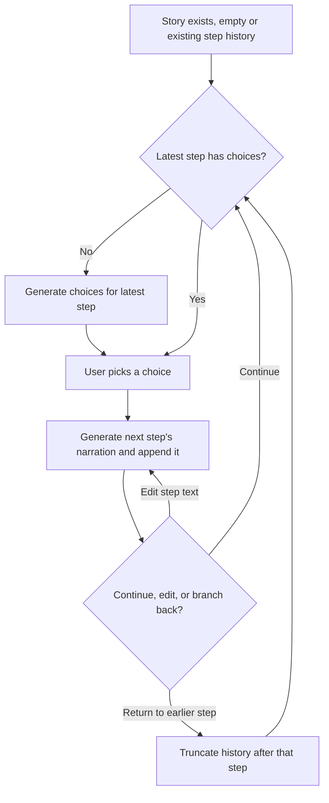

# Choice-Driven Story Play

This document describes the end-to-end algorithm behind playing a **choice-driven** story: how a story starts, how it progresses in choice/step cycles, and how the user can branch backward and redirect it. It focuses on the logic and sequence of steps, not on code structure.

Related docs: `requirements.md` (behavior), `endpoints.md` (API contract), `data_storage_structure.md` (persisted data).

## 1. Prerequisite: the story exists

A choice-driven story is prepared outside the application (title, `type: choice_driven`, its characters, and the fields that drive generation). The app does not create stories or characters — it only reads them. A choice-driven story's definition includes:

- `user_character_id`: the character the user plays.
- `character_ids`: supporting characters who may appear in the story.
- `writing_style`: instructions that steer how the story is narrated.
- `plot_directions`: a list of distinct narrative angles used to generate choice options (e.g. "reveal a clue", "introduce a complication").

Unlike scene-based stories, a choice-driven story has no separate "create scene" step — its progression is a single, ongoing sequence of **steps**, starting empty and growing one step at a time as the user plays.

## 2. Steps and choices

The story's history is an ordered list of **steps**. Each step has:

- `text`: the narrated story text for that step.
- `incoming_choice`: the action/consequence pair that led into this step (`null` for the first step).
- `choices`: the list of options currently offered to continue from this step (empty until generated, and only meaningful on the latest step).

Only the **latest step** in the list can have live, actionable choices — earlier steps are historical narration plus a record of which choice was taken next.

## 3. Generating choices

Once at least one step exists, the user can request choices for the latest step:

1. **Gather context.** Load the story's metadata (user character, supporting characters, writing style, plot directions) and the full step history. Concatenate all step texts so far into the running story text.
2. **Generate one batch of choices per plot direction, in parallel.** For each configured `plot_direction`, ask the model for a list of action/consequence choice pairs consistent with that direction, the story so far, and the character profiles involved.
3. **Combine and store.** Merge all directions' results into one flat list of choices and attach them to the latest step, replacing whatever choices it had.

Regenerating choices is the same process, first clearing the latest step's existing choices and then generating a fresh batch.

## 4. Selecting a choice

Choosing one of the offered choices advances the story by one step:

1. **Gather a bounded window of context.** Take the last several steps (a fixed-size trailing window, not the entire history) and concatenate their text as the recent story context — this keeps prompts bounded as the story grows long.
2. **Generate the next step's narration.** Ask the model to continue the story from that recent context, given the chosen choice's action and consequence, the user/supporting character profiles, and the story's writing style.
3. **Append the new step.** Assign it the next step ID (one greater than the last step's ID, or `1` if this is the first step ever), record the chosen `incoming_choice`, set its `text` to the generated narration, and start it with an empty `choices` list.

The new step becomes the latest step, with no choices yet — the user generates choices for it (step 3) to keep playing.

## 5. Correcting the story

Two operations let the user adjust the recorded history:

- **Edit a step's text.** Replace the narrated text of any step in place, without changing its ID, its `incoming_choice`, or its position in the sequence.
- **Return to an earlier step.** Roll the story back to a chosen step, discarding every step that comes after it. The chosen step becomes the new latest step again, and its choices (if it has any left) or a fresh `generate_choices` call let the user continue from there with a different path.

## 6. The overall loop

Each pass through this loop adds one step to the story. Because only the latest step ever carries live choices, the story is always a single linear path at any point in time — branching happens only by rolling back and choosing differently, which discards the abandoned path rather than keeping it alongside.
