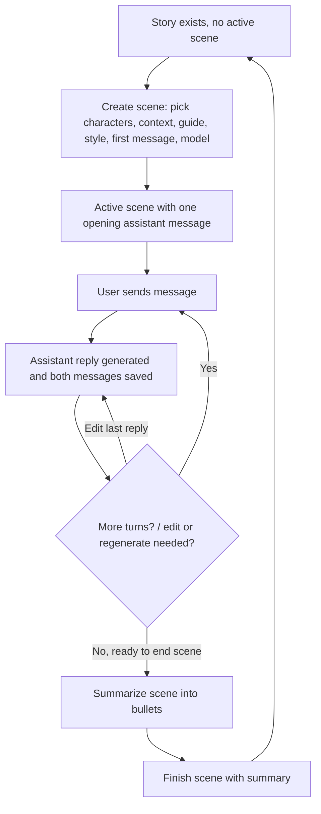

# Scene-Driven Story Play

This document describes the end-to-end algorithm behind playing a **scene-based** story: how a story starts, how a scene is created, how it is played turn by turn, and how it is finished so the next scene can begin. It focuses on the logic and sequence of steps, not on code structure.

Related docs: `requirements.md` (behavior), `endpoints.md` (API contract), `data_storage_structure.md` (persisted data).

## 1. Prerequisite: the story exists

A scene-based story is prepared outside the application (title, `type: scene`, and its characters). The app does not create stories or characters — it only reads them. From the app's point of view, story play begins once a story with `type: scene` and zero or more characters already exists.

A story has at most **one active (unfinished) scene at a time**. Play always happens against "the current scene" of a story: either there is an active scene to continue, or there is none and a new scene must be created first.

## 2. Creating a scene

A scene can be created only when the story currently has no active scene (the previous scene, if any, must be finished first).

Steps to create a scene:

1. **Choose participants.** Pick the user's character (or "Narrator" for stories that support playing without a user character) and the set of other characters who appear in the scene.
2. **Provide scene inputs.**
   - `context`: bullet facts the scene should start from (state of the world, prior events).
   - `general_scene_guide` and `writing_style`: instructions that steer how the assistant narrates the scene.
   - `first_message`: the opening assistant message that kicks off the scene (written by the user, not generated).
   - `model_id`: which language model will be used for this scene's replies.
3. **Continuity from a prior scene.** If the story has a previous *finished* scene, its ending state seeds the new scene's inputs as a starting point (which the user can still edit before submitting):
   - the previous scene's `context` plus its recorded `scene_summary` become the new scene's starting `context`,
   - the previous scene's `writing_style` is reused,
   - the previous scene's last assistant message is reused as a starting point for the new `first_message`,
   - the model used for the previous scene's last assistant reply becomes the default selected model.
   - This is only a starting point for a new set of scene inputs — it is not a link back to the old scene's data. Once created, the new scene is independent.
4. **Validation.** The chosen model must exist in the model registry. A user character is required for stories that don't support "no user character" (narrator) mode. There must be no other active scene for the story.
5. **Assign the scene ID.** The next scene ID is one greater than the highest existing scene ID for the story (or `1` if this is the first scene).
6. **Persist the scene.** The scene is created as *active* (`finished = false`) with the given metadata, and its message list starts with a single assistant message (`id = 1`) containing `first_message`.

At this point the story has a new active scene with one opening message, ready to be played.

## 3. Playing a scene (sending a message)

Playing a scene is a turn-based exchange: the user sends a message, the assistant replies, and both are recorded together.

1. **Guard.** The scene must not already be finished.
2. **Gather context for the model.** Load the scene's metadata (guide, writing style, participants), the participating characters' cards, the user's character card (if any), the scene's accumulated `context` bullets, and the full message history so far.
3. **Pick the model.** Use the explicitly requested model if given; otherwise reuse whichever model produced the most recent assistant message; otherwise fall back to the registry's default model.
4. **Generate the reply.** Send the assembled context (system instructions built from the scene/character/writing-style data, followed by the message history, followed by the new user message) to the language model and get back the assistant's reply.
5. **Record the turn.** Assign the next two message IDs (user message, then assistant message) and persist both together in a single update, only after the model call succeeds. If the model call fails, nothing is added to history — the turn simply didn't happen.
6. **Record usage.** Log which model was used and its token/cost usage for this reply, tagged to the scene and the new assistant message.

This produces one new user/assistant message pair per turn, appended to the ongoing conversation.

## 4. Correcting a turn

Two operations let the user fix mistakes in an unfinished scene without replaying the whole scene:

- **Edit a message.** Replace the text content of an existing message (user or assistant) while keeping its ID and role. Only allowed while the scene is active.
- **Delete a message.** Remove a message from history. Remaining messages keep their original IDs (no renumbering), so deleting a message can leave gaps in the ID sequence.
- **Regenerate the last reply.** If the scene's last message is an assistant message, discard it and re-run the same generation step (using the same model-resolution rule and the same preceding user message as input) to produce a new reply, overwriting the old one in place (same message ID). This is useful when the user likes their own last message but wants a different assistant response.

All three require the scene to still be active.

## 5. Finishing a scene

When the user is done with a scene:

1. **Summarize (optional but typical step before finishing).** The assistant is asked to condense the scene's message history into a short list of summary bullets, taking the scene's existing `context` (bounded to a maximum number of recent items) as prior context so the summary stays consistent with what came before. This does not change the scene by itself — it just produces candidate summary text for the user to review/edit.
2. **Finish.** The user submits a final summary (usually the generated one, possibly edited). The scene is marked `finished = true` and the summary is stored on the scene. A scene can only be finished once; finishing an already-finished scene is rejected.

Once finished, the scene becomes read-only: no more messages can be played, edited, deleted, or regenerated against it, and the story once again has *no active scene* — clearing the way for the next scene to be created.

## 6. The overall loop

Each pass through this loop is one scene. The story progresses as a sequence of finished scenes, where each new scene can carry forward the accumulated context and summary of the one before it, until the user stops creating new scenes.
